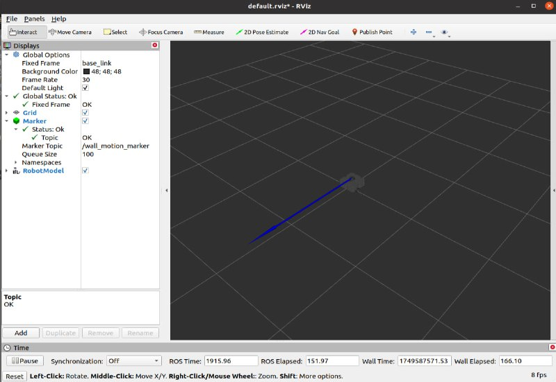

# Домашнее задание №4 - Sensor Filtering

## Задание 1 - Симуляция в Gazebo

Запуск **gazebo** 

```
roslaunch lidar_tasks gazebo.launch
```

Запуск **teleopkey**

```
roslaunch turtlebot3_teleop turtlebot3_teleop_key.launch
```

## Задание 2 - Фильтрация данных лидара

Запуск **gazebo** 

```
roslaunch lidar_tasks gazebo.launch
```

Запуск **узла для фильтрации** 

```
rosrun lidar_tasks subscriber.py
```

Ответ на вопрос (Отличается ли частота от топика **/scan** от **/scan_filtered**?): 

Разница если и есть, то минимальная. Задержка заключется в том, что тратится время на фильтрацию данных лидара из **/scan**

## Задание 3 - Определение расстояния и направления движения

Запуск **gazebo** 

```
roslaunch lidar_tasks gazebo.launch
```

Запуск **teleopkey**

```
roslaunch turtlebot3_teleop turtlebot3_teleop_key.launch
```

Запуск **узла для фильтрации** 

```
rosrun lidar_tasks subscriber.py
```

Запуск **узла для публикации состояния робота** 

```
rosrun lidar_tasks wall_state.py
```


Просмотр топика 

```
rostopic echo /wall_motion
```


Запуск **rviz** 

```
roslaunch lidar_tasks rviz.launch
```

**Демонстрация маркера**




## Задание 4 - Как бы вы реализовали оценку точности вычисления расстояния вашим алгоритмом в Gazebo?

Можно выставлять робота на заранее определённую дистанцию в симуляторе, и затем сравнить показание алгоритма с реальным значением в симуляторе и посчитать отклонение. Затем, провести еще n тестов с разными дистанциями